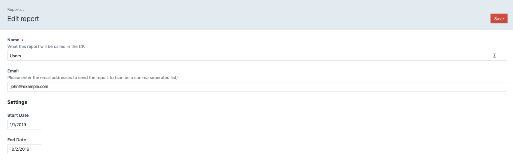

# Big Reports plugin for Craft CMS 3.x

Big Reports is a plugin that allows you to create reports using Twig and have the results emailed to you as a CSV. Ideal for large data sets.

## Requirements

This plugin requires Craft CMS 3.0.0 or later.

## Installation

To install the plugin, follow these instructions.

1.  Open your terminal and go to your Craft project:

        cd /path/to/project

2.  Then tell Composer to load the plugin:

        composer require kuriousagency/bigreports

3.  In the Control Panel, go to Settings → Plugins and click the “Install” button for Craft Reports.

## Craft Reports Overview

Set your columns by using the `craft.bigreports.service.columns()` method, then add your row data by using the `craft.bigreports.service.row()`.

Last thing to do is to use the `craft.bigreports.service.data()` method to output the data.

Here is an example report in Twig:

```twig



	


{{ craft.bigreports.service.data }}
```

**Options**

Big Reports can have options that are based on Craft CP forms macro.

```twig
{{ craft.forms('dateField', {
    id: 'startDate',
    label: "Start Date"|t,
    name: 'options[startDate]',
    value: options.startDate
}) }}
```

These options can then be accessed in the results. Here's an example that lists all users that have registered between two dates

```twig





	


{{ craft.bigreports.service.data }}
```

The results are sent as a CSV attachment to the email address specifed on the report



## Configuring Big Reports

**Reports Template Path**

Set the directory to find report templates

Here's an example folder structure

```twig
templates
   _reports
       users
          results.twig
          settings.twig
```

In the above case you would enter \_reports as the template path

**Email Template Path**

If you would like to use your own email template to send the report you can set it here

**Example files**

Examples can be found here: https://github.com/KuriousAgency/craft-bigreports/examples

Brought to you by [Kurious Agency](https://kurious.agency)
